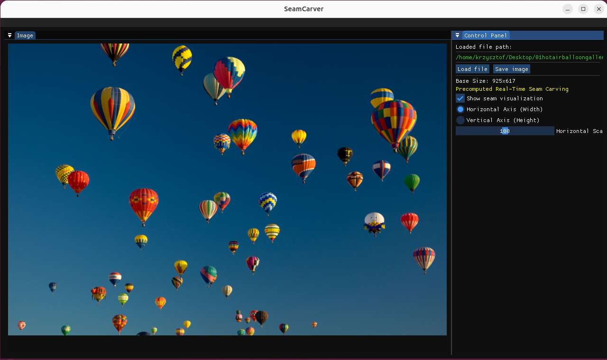
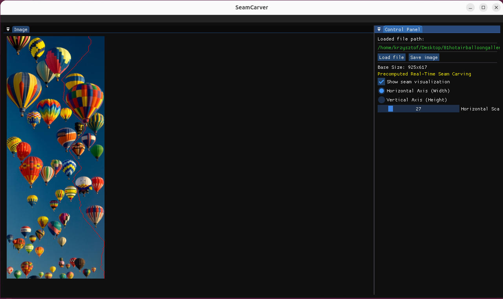
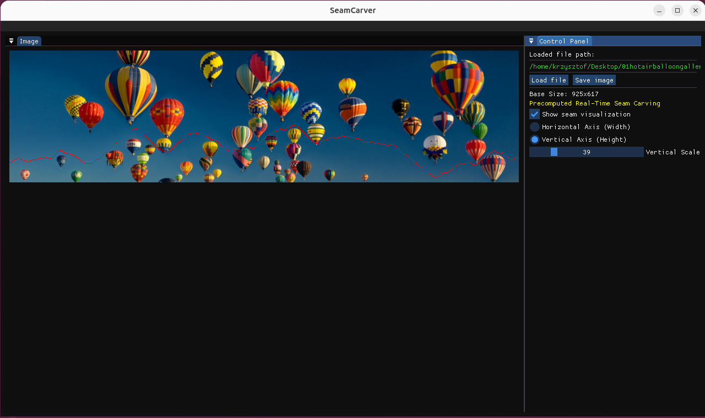

# Inteligentne skalowanie obrazów

## Opis

Inteligentne skalowanie obrazów (Content-Aware Image Resizing) przy użyciu algorytmu Seam Carving.

## Skład zespołu

- Krzysztof Jabłoński
- Jakub Szydełko
- Marcin Zepp

## Idea rozwiązania i algorytmy

Celem projektu jest stworzenie aplikacji desktopowej pozwalającej na zmianę rozmiaru obrazu bez zniekształcania kluczowych obiektów, poprzez usuwanie pikseli o najmniejszym znaczeniu dla odbiorcy.

### MVP

Aplikacja ładuje obraz poprzez mechanizm **drag-and-drop**. Wraz ze zmianą rozmiaru ramki obrazu załadowany obraz jest na bieżąco skalowany (przycinany/rozszerzany) z wykorzystaniem algorytmu Seam Carving, dopasowując się do aktualnie dostępnego miejsca.

### Kluczowe elementy rozwiązania

#### Funkcja energii

Aplikacja zaczyna od przygotowania mapy energii, czyli pomocniczego obrazu opisującego, jak ważne są poszczególne piksele dla odbioru całości. Obraz wejściowy jest konwertowany do skali szarości, a następnie przetwarzany operatorem Sobela w kierunku poziomym i pionowym. Dla każdego piksela obliczana jest suma wartości bezwzględnych gradientów:

```text
energia(x, y) = |gradient_x(x, y)| + |gradient_y(x, y)|
```

Wysoka energia oznacza zwykle krawędź, kontur obiektu, teksturę albo fragment o dużej zmianie jasności. Takie piksele powinny być chronione, bo ich usunięcie byłoby zauważalne. Niska energia występuje najczęściej w tle, na niebie, ścianach, wodzie lub innych jednolitych fragmentach obrazu. Algorytm wybiera właśnie te obszary jako najlepsze miejsca do zwężania albo rozszerzania obrazu.

Obliczanie energii jest wykonywane wielokrotnie, ponieważ po usunięciu każdego szwu zmienia się sąsiedztwo pikseli. Z tego powodu część pętli jest zrównoleglona z użyciem OpenMP, aby przyspieszyć przetwarzanie kolejnych wierszy obrazu.

#### Programowanie dynamiczne

Na podstawie mapy energii wyszukiwany jest szew, czyli ciągła ścieżka pikseli przechodząca przez cały obraz. Przy zmianie szerokości szew pionowy zawiera po jednym pikselu z każdego wiersza. Kolejne piksele szwu mogą znajdować się bezpośrednio pod poprzednim pikselem, pod nim po lewej albo pod nim po prawej. Dzięki temu ścieżka jest ciągła i nie tworzy gwałtownych przeskoków.

Do znalezienia szwu o najmniejszym koszcie wykorzystywane jest programowanie dynamiczne. Dla każdego piksela zapisywany jest minimalny koszt dotarcia do niego z górnej krawędzi obrazu. Koszt ten składa się z energii aktualnego piksela oraz najmniejszego kosztu jednego z trzech możliwych poprzedników z wiersza powyżej. Po wypełnieniu całej tablicy wybierany jest piksel o najmniejszym koszcie w ostatnim wierszu, a następnie algorytm odtwarza całą ścieżkę od dołu do góry.

W implementacji wykorzystywane są dwie pomocnicze macierze:

- `M` przechowuje skumulowany koszt najtańszej ścieżki prowadzącej do danego piksela,
- `backtrack` przechowuje informację, z której kolumny w poprzednim wierszu przyszła najlepsza ścieżka.

Zmiana wysokości jest realizowana tym samym mechanizmem. Obraz jest transponowany, dzięki czemu problem wyszukiwania szwu poziomego można sprowadzić do wyszukiwania szwu pionowego. Po zakończeniu przetwarzania wynik jest transponowany z powrotem.

#### Usuwanie/Dodawanie szwów

Zmniejszanie obrazu polega na wielokrotnym usuwaniu szwów o najniższej energii. Po znalezieniu szwu każdy wiersz obrazu jest przesuwany tak, aby pominąć piksel należący do tego szwu. W efekcie szerokość obrazu zmniejsza się o jeden piksel, ale usunięty zostaje możliwie najmniej zauważalny fragment.

Powiększanie działa odwrotnie: najpierw wyznaczane są szwy, które w razie zmniejszania zostałyby usunięte jako najmniej istotne. Następnie w tych miejscach dodawane są nowe piksele. Wartość dodanego piksela jest obliczana na podstawie sąsiednich pikseli, najczęściej jako uśrednienie aktualnego piksela i jego sąsiada. Dzięki temu obraz jest rozszerzany lokalnie, w miejscach najmniej istotnych wizualnie, zamiast być równomiernie rozciągany jak przy zwykłym skalowaniu.

W klasycznej wersji algorytmu każda kolejna zmiana rozmiaru wymaga ponownego wyznaczenia energii i najlepszego szwu. Daje to dobrą jakość, ale jest kosztowne obliczeniowo, szczególnie przy większych obrazach lub częstej zmianie wartości suwaka.

#### Cache wyniku w `SeamCarver`

Klasa `SeamCarver` przechowuje obraz bazowy oraz ostatnio obliczony wynik. Jeśli użytkownik zmienia rozmiar stopniowo w tym samym kierunku, aplikacja może rozpocząć dalsze przetwarzanie od ostatniego wyniku zamiast od obrazu oryginalnego. Ogranicza to liczbę operacji potrzebnych przy kolejnych podobnych żądaniach.

Cache jest odrzucany wtedy, gdy nie pasuje do nowego kierunku skalowania, na przykład gdy poprzedni wynik był mniejszy od obrazu bazowego, a nowy cel wymaga powiększenia. W takiej sytuacji przetwarzanie zaczyna się ponownie od oryginalnego obrazu, aby uniknąć pogorszenia jakości albo błędnej kolejności operacji.

#### Prekomputacja i podgląd w czasie rzeczywistym

Do obsługi interaktywnego suwaka używany jest `FastCarver`. Podczas wczytywania obrazu wykonywana jest prekomputacja dla aktualnie wybranej osi. Algorytm usuwa kolejne szwy z kopii obrazu i zapisuje informację, w którym kroku dany piksel zostałby usunięty. Te dane są przechowywane w macierzy `indexMap`.

`indexMap` działa jak mapa kolejności usuwania pikseli. Jeśli użytkownik ustawi docelową szerokość mniejszą niż oryginalna, program nie musi od nowa liczyć wszystkich szwów. Wystarczy pominąć piksele, których numer usunięcia mieści się w zakresie wymaganym do uzyskania danej szerokości. Dla powiększania obrazu ta sama mapa wskazuje miejsca, w których można dodać piksele.

Dzięki temu przesuwanie suwaka skali jest znacznie płynniejsze. Kosztowna część pracy wykonywana jest raz podczas wczytywania obrazu lub zmiany osi, a późniejsze generowanie podglądu polega głównie na szybkim składaniu obrazu wynikowego z wcześniej policzonych informacji.

#### Obsługa osi skalowania

Aplikacja pozwala wybrać jedną z dwóch osi:

- `Horizontal Axis (Width)` zmienia szerokość obrazu,
- `Vertical Axis (Height)` zmienia wysokość obrazu.

Wewnętrznie algorytm jest zoptymalizowany pod operacje na szerokości. Dla skalowania wysokości obraz jest transponowany, przetwarzany tak jak przy zmianie szerokości, a następnie odwracany do pierwotnej orientacji. Po zmianie osi wykonywana jest nowa prekomputacja, ponieważ kolejność szwów dla szerokości i wysokości jest inna.

#### Wizualizacja szwu

Program pozwala włączyć podgląd aktualnie używanego szwu. Szew jest rysowany na czerwono w widoku obrazu, co ułatwia ocenę, które fragmenty zostaną usunięte albo powielone przy zmianie rozmiaru. Przy zmniejszaniu wizualizacja wskazuje kolejny szew usuwany z obrazu, a przy powiększaniu pokazuje miejsce dodawania nowych pikseli.

Wizualizacja dotyczy tylko podglądu w aplikacji. Obraz zapisywany na dysku pochodzi z właściwego wyniku skalowania i nie zawiera czerwonego oznaczenia szwu.

#### Wczytywanie, przetwarzanie i zapis obrazu

Obrazy są wczytywane przez OpenCV, które obsługuje popularne formaty plików, między innymi PNG, JPG, JPEG, BMP i WEBP. Użytkownik może przeciągnąć plik do okna programu albo wybrać go przez systemowe okno dialogowe. Po wczytaniu obrazu aplikacja uruchamia prekomputację w osobnym zadaniu asynchronicznym, aby nie blokować całego interfejsu.

Wynik skalowania jest przechowywany oddzielnie od obrazu wejściowego. Dzięki temu oryginalny obraz pozostaje bazą do kolejnych operacji, a użytkownik może zmieniać skalę bez trwałego nadpisywania danych źródłowych. Zapis odbywa się przez OpenCV; jeśli użytkownik poda ścieżkę bez rozszerzenia, program dopisuje domyślne rozszerzenie `.png`.

## Technologie

- **C++20** – główny język programowania.
- **OpenMP** – biblioteka używana do zrównoleglenia obliczeń (np. jednoczesne liczenie mapy energii dla różnych wierszy obrazu). Pozwala na znaczne przyspieszenie działania algorytmu Seam Carving.
- **OpenCV** – wykorzystywane do wstępnego przetwarzania obrazu (wczytywanie i zapisywanie plików w różnych formatach, takich jak PNG/JPG).
- **SDL3** – niskopoziomowa biblioteka deweloperska używana do stworzenia okna aplikacji, zarządzania kontekstem graficznym oraz obsługi zdarzeń. Odpowiada za bezpośrednie, wydajne renderowanie przetworzonych klatek obrazu na ekranie.
- **Dear ImGui** – lekka biblioteka graficznego interfejsu użytkownika (Immediate Mode GUI). Służy do stworzenia panelu kontrolnego aplikacji.
- **CMake** – system automatyzacji procesu budowania projektu. Gwarantuje niezależność od platformy i ułatwia automatyczne linkowanie zewnętrznych bibliotek na systemach Windows, Linux oraz macOS.


## Plan pracy

1. Przygotowanie repozytorium i struktury projektu. ✔️
2. Przygotowanie narzędzi do budowania projektu. ✔️
3. Dodanie obsługi zdarzenia drag-and-drop dla plików graficznych. ✔️
4. Implementacja funkcji obliczającej mapę energii obrazu. ✔️
5. Implementacja algorytmu wyszukiwania optymalnego szwu pionowego i poziomego. ✔️
6. Implementacja mechanizmu usuwania wskazanych szwów z macierzy obrazu. ✔️
7. Stworzenie interfejsu graficznego (GUI). ✔️
8. Integracja algorytmu z logiką interfejsu – podpięcie algorytmu pod zdarzenia zmiany rozdzielczości. ✔️
9. Ewentualna optymalizacja algorytmów. ✔️
10. Ręczne testowanie aplikacji. ✔️
11. Opracowanie szczegółowej dokumentacji. ✔️

## Podział zadań

Podział zadań w zespole:

- **Jakub Szydełko** - przygotowanie repozytorium, konfiguracji CMake i submodułów, integracja bibliotek SDL3, Dear ImGui oraz OpenCV, stworzenie głównego okna aplikacji, układu GUI, obsługi przeciągania plików, okien wyboru pliku, zapisu obrazu oraz integracja algorytmu z panelem sterowania.
- **Marcin Zepp** - przygotowanie bazowej implementacji algorytmu Seam Carving, w tym obliczania mapy energii, wyszukiwania optymalnych szwów, usuwania i dodawania szwów oraz cache wyników przy zmianie rozdzielczości.
- **Krzysztof Jabłoński** - implementacja i rozwój elementów związanych z `FastCarver`, w tym prekomputacji szwów oraz szybkiego generowania podglądu dla suwaka skali, wsparcie integracji algorytmu z aplikacją, poprawki kompilacji oraz testowanie działania programu po połączeniu części algorytmicznej z interfejsem.
- **Cały zespół** - ręczne testowanie aplikacji, analiza jakości wyników skalowania, przygotowanie opisu projektu oraz końcowej dokumentacji.

## Instrukcja działania

### Instalacja

Wymagane narzędzia:

- CMake w wersji co najmniej 3.20,
- kompilator obsługujący C++20,
- Ninja albo Make, zależnie od wybranego presetu,
- obsługa OpenMP w używanym kompilatorze,
- Git z obsługą submodułów.

Na Linuksie, przed konfiguracją projektu, należy zainstalować zależności systemowe wymagane do zbudowania SDL3, OpenCV oraz aplikacji:

```bash
sudo apt install build-essential cmake make pkg-config \
  libx11-dev libxext-dev libxrandr-dev libxcursor-dev libxfixes-dev libxi-dev libxss-dev libxtst-dev \
  libxkbcommon-dev libwayland-dev libdecor-0-dev \
  libgl1-mesa-dev libgles2-mesa-dev libegl1-mesa-dev \
  libasound2-dev libpulse-dev libudev-dev libusb-1.0-0-dev
```

Po sklonowaniu repozytorium należy pobrać biblioteki zewnętrzne:

```powershell
git submodule update --init --recursive
```

Repozytorium zawiera presety CMake dla kilku środowisk:

- `clang-debug` - konfiguracja debug dla Clanga i Ninja,
- `gcc-linux-debug` - konfiguracja debug dla GCC na Linuksie,
- `clang-macos-homebrew-debug` - konfiguracja debug dla Clanga z Homebrew na macOS.

Konfiguracja projektu:

```powershell
cmake --preset clang-debug
```

Budowanie projektu:

```powershell
cmake --build --preset clang-debug
```

### Uruchomienie

Po zbudowaniu aplikacji z presetem `clang-debug` plik wykonywalny znajduje się w katalogu:

```text
build/clang-debug/AiPOProject.exe
```

Na Windows można uruchomić go z katalogu projektu:

```powershell
.\build\clang-debug\AiPOProject.exe
```

Na Linuksie lub macOS należy użyć odpowiedniego katalogu wygenerowanego przez wybrany preset.

## Instrukcja użytkowania

1. Uruchom aplikację.
2. Wczytaj obraz, przeciągając plik graficzny do okna programu albo klikając przycisk `Load file`.
3. Poczekaj na zakończenie prekomputacji. Dla większych obrazów może to potrwać dłużej.
4. W panelu `Control Panel` wybierz oś skalowania:
   - `Horizontal Axis (Width)` zmienia szerokość obrazu,
   - `Vertical Axis (Height)` zmienia wysokość obrazu.
5. Ustaw docelową skalę suwakiem. Zakres wynosi od 1% do 200% wymiaru bazowego dla wybranej osi.
6. Włącz albo wyłącz opcję `Show seam visualization`, aby zobaczyć czerwone oznaczenie aktualnego szwu w podglądzie.
7. Kliknij `Save image`, aby zapisać wynik. Jeśli podana nazwa pliku nie ma rozszerzenia, program dopisze `.png`.

## Przykład działania

Przykładowy scenariusz:

1. Użytkownik uruchamia aplikację i wczytuje obraz `landscape.jpg`.
2. Program wyświetla komunikat o prekomputacji, a następnie pokazuje obraz w panelu `Image`.
3. Użytkownik wybiera `Horizontal Axis (Width)` i ustawia skalę na 70%.
4. Aplikacja usuwa najmniej istotne szwy pionowe, zmniejszając szerokość obrazu przy zachowaniu ważnych obiektów.
5. Po włączeniu wizualizacji użytkownik widzi czerwony przebieg szwu używanego w danym kroku.
6. Użytkownik zapisuje wynik przyciskiem `Save image`, np. jako `landscape_resized.png`.

Analogicznie można zwiększyć szerokość albo zmienić wysokość obrazu przez przełączenie osi skalowania.

### Wizualne przykłady działania

Zależnie od wybranej osi pracy, algorytm inteligentnie wycina odpowiednie szwy z obrazu:

**1. Obraz oryginalny**
Zdjęcie wyjściowe wczytane do aplikacji przed wprowadzeniem jakichkolwiek modyfikacji.



**2. Skalowanie horyzontalne (szerokość)**
Przykład zmniejszania szerokości. Aplikacja wyszukuje i redukuje mało istotne szwy pionowe, chroniąc tym samym główne obiekty i naturalne proporcje w poziomie.



**3. Skalowanie wertykalne (wysokość)**
Przykład skalowania w pionie. Tym razem zmniejszana jest wysokość obrazu poprzez usuwanie (lub powielanie) szwów poziomych o najniższej energii.



## Co nie działa

Znane ograniczenia aktualnej wersji:

- aplikacja przetwarza jedną oś naraz; nie ma możliwości jednoczesnego skalowania w pionie i poziomie, ponieważ pełna prekomputacja dla obu osi na CPU byłaby zbyt kosztowna czasowo dla płynnej pracy programu,
- możliwym kierunkiem rozwoju jest przeniesienie najbardziej kosztownych obliczeń na GPU, co mogłoby umożliwić szybsze przeliczanie szwów i wygodniejsze skalowanie w obu osiach,
- bardzo duże obrazy mogą wymagać dłuższego czasu prekomputacji oraz większej ilości pamięci,
- algorytm nie korzysta z masek ochronnych ani masek usuwania obiektów,
- jakość wyniku zależy od zawartości obrazu; przy bardzo gęstych detalach lub wielu ważnych obiektach zniekształcenia mogą być widoczne.
